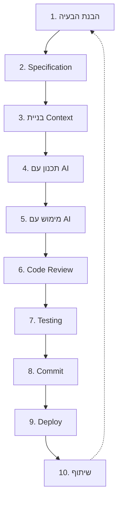
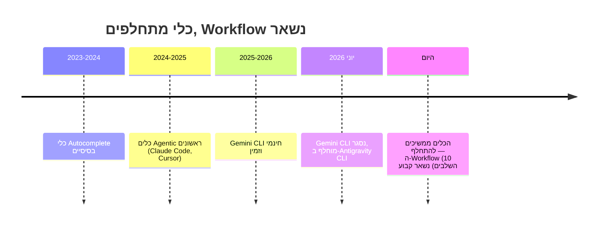

# diagrams.md — שיעור 1

דיאגרמות ככתיב Mermaid (ניתן להטמיע ישירות בכלי מצגות/Markdown מודרני התומך ב-Mermaid, כגון Marp עם plugin, Obsidian, GitHub Markdown, ועוד).

## דיאגרמה 1: ה-Workflow בן 10 השלבים

שימו לב לחץ המקווקו בסוף (10 → 1) — מדגיש שזה תהליך איטרטיבי, לא ליניארי חד-פעמי.

## דיאגרמה 2: ציר זמן — Workflow לעומת כלי

