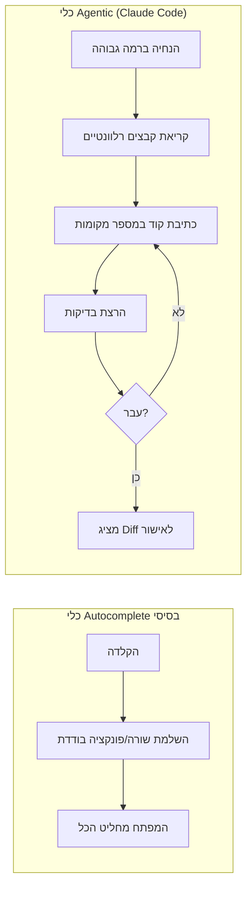
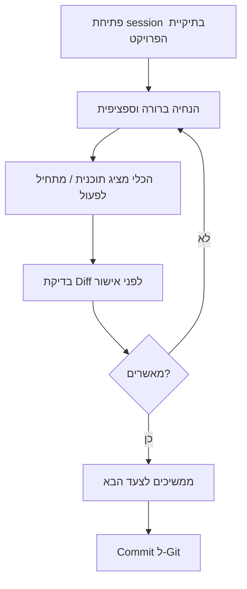

# diagrams.md — שיעור 2

## דיאגרמה 1: Autocomplete לעומת Agentic

```mermaid
flowchart LR
    subgraph Autocomplete["כלי Autocomplete בסיסי"]
        A1[הקלדה] --> A2[השלמת שורה/פונקציה בודדת]
        A2 --> A3[המפתח מחליט הכל]
    end

    subgraph Agentic["כלי Agentic (Claude Code)"]
        B1[הנחיה ברמה גבוהה] --> B2[קריאת קבצים רלוונטיים]
        B2 --> B3[כתיבת קוד במספר מקומות]
        B3 --> B4[הרצת בדיקות]
        B4 --> B5{עבר?}
        B5 -->|לא| B3
        B5 -->|כן| B6[מציג Diff לאישור]
    end
```

## דיאגרמה 2: תהליך עבודה טיפוסי מול Claude Code

```mermaid
flowchart TD
    S1[פתיחת session בתיקיית הפרויקט] --> S2[הנחיה ברורה וספציפית]
    S2 --> S3[הכלי מציג תוכנית / מתחיל לפעול]
    S3 --> S4[בדיקת Diff לפני אישור]
    S4 --> S5{מאשרים?}
    S5 -->|כן| S6[ממשיכים לצעד הבא]
    S5 -->|לא| S2
    S6 --> S7[Commit ל-Git]
```
